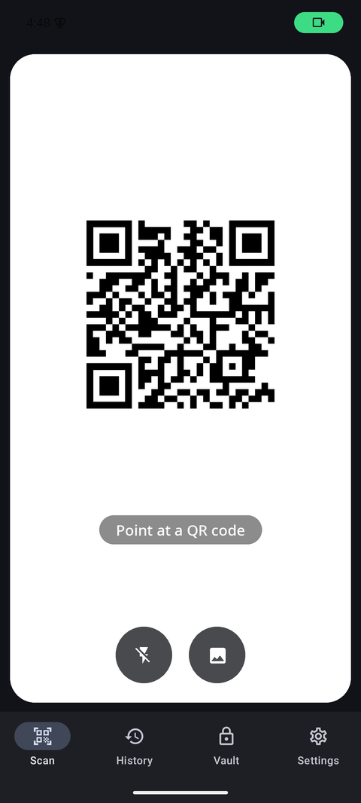
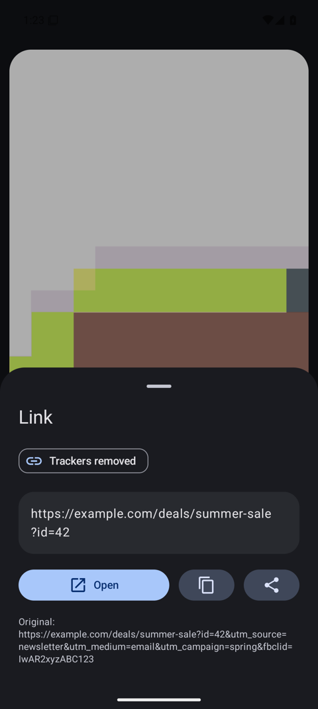
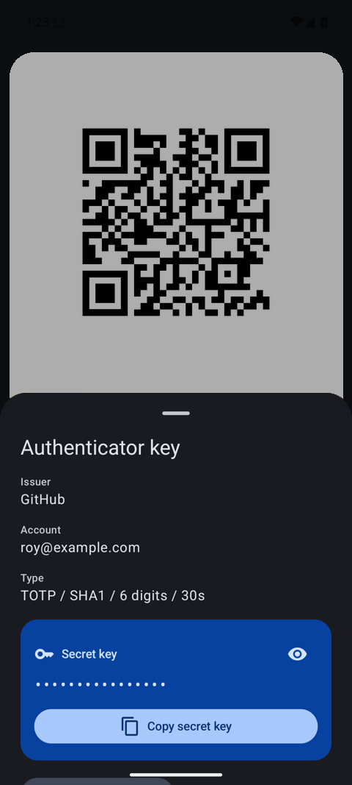
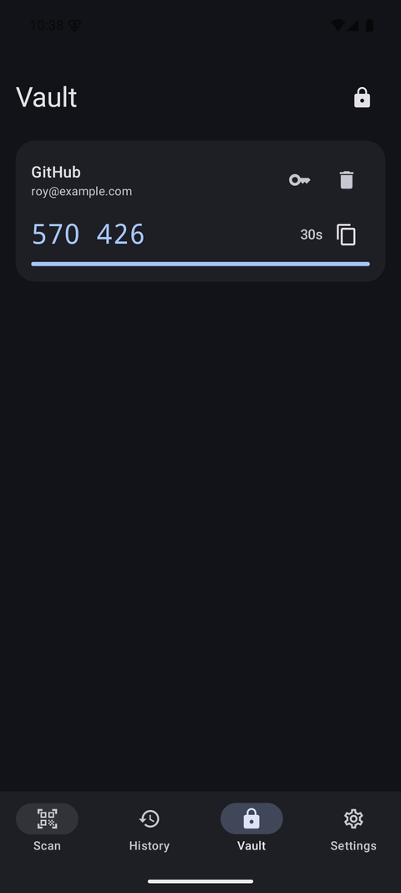
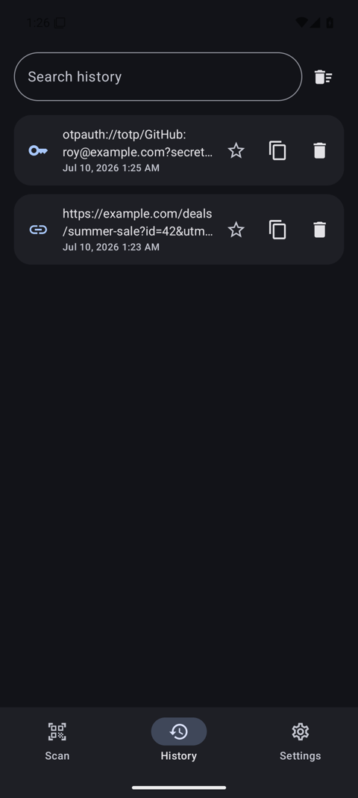
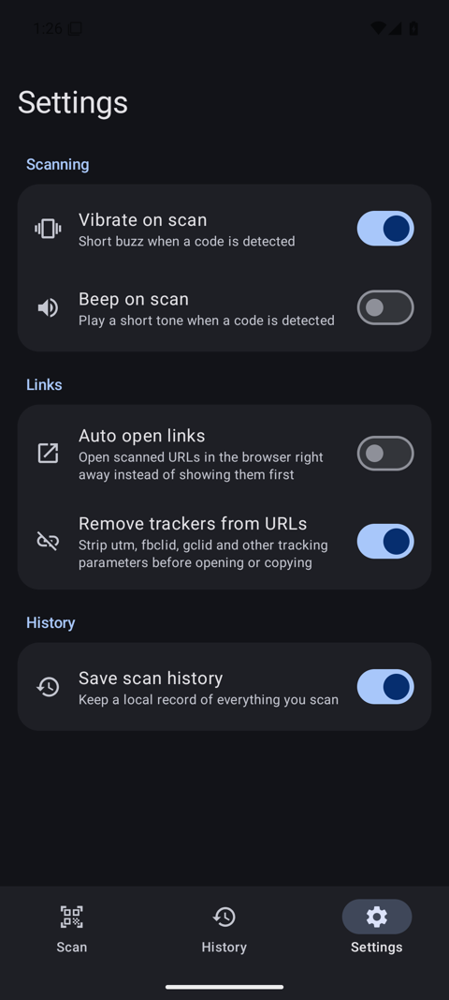

# QR Scanner

A fast, dark-mode QR and barcode scanner for Android. Built with Kotlin, Jetpack Compose, CameraX, and ML Kit. Everything runs on the device: no internet permission, no analytics, no ads.

[**Download the APK from the latest release**](https://github.com/sudomastery/qr-code-scanner/releases/latest)

## Screenshots

| Scan | Link result with tracker removal | OTP secret extractor |
| :---: | :---: | :---: |
|  |  |  |

| Vault with live codes | History | Settings |
| :---: | :---: | :---: |
|  |  |  |

## Features

- **Fast on-device scanning** with ML Kit and CameraX. Reads QR, Aztec, Data Matrix, PDF417, EAN, UPC, Code 128/39/93, Codabar, and ITF codes.
- **URL tracker removal**: strips utm_*, fbclid, gclid, msclkid, igshid, si, mkt_tok, and dozens of other tracking parameters before you open, copy, or share a link. The original URL stays visible so you can see what was removed.
- **OTP key extractor**: scanning an otpauth:// code shows the issuer, account, and algorithm details, with the secret key masked by default and a one-tap copy button. Handy when an authenticator app will not import a code directly.
- **Encrypted vault for authenticator keys**: save scanned OTP secrets to a vault that unlocks with your fingerprint, face, or device PIN, the same way banking apps do. Secrets are encrypted with a hardware-backed Android Keystore key, vaulted scans are kept out of history entirely, and the vault relocks after 60 seconds or when the app goes to background. Inside, each entry shows a live rolling TOTP code with a countdown, so the vault doubles as a backup authenticator. An optional setting sends every scanned otpauth code straight to the vault.
- **Scan history**: every scan is saved locally with search, favorites, per-item copy and delete, and clear-all. Can be turned off entirely.
- **Auto open or review first**: choose whether links open in the browser immediately or show a result sheet first.
- **Vibrate and beep on scan**, each toggleable.
- **Wi-Fi codes**: shows network name and security, with the password masked and copyable.
- **Recognizes** email, phone, SMS, geo, and contact (vCard/MECARD) codes with matching actions.
- **Scan from images**: pick any photo from your gallery and decode it.
- **Flashlight toggle and pinch to zoom** in the camera view.
- **Dark Material You design** with large rounded corners throughout.

## Privacy

The app has no INTERNET permission, so nothing can leave your phone. History lives in a local database and can be disabled or wiped from Settings. Vaulted authenticator secrets are encrypted at rest with an AES key that lives in the Android Keystore and never leaves the device's secure hardware.

## Building

Requires JDK 17+ and the Android SDK (compileSdk 35).

```sh
./gradlew assembleDebug
```

The APK lands in `app/build/outputs/apk/debug/`. Release builds (`./gradlew assembleRelease`) are minified and signed with the local debug keystore for sideloading; replace the signing config for store distribution.

## Install on a device

Either download the APK from the [releases page](https://github.com/sudomastery/qr-code-scanner/releases/latest) and open it on your phone, or install over adb:

```sh
adb install app/build/outputs/apk/release/app-release.apk
```
